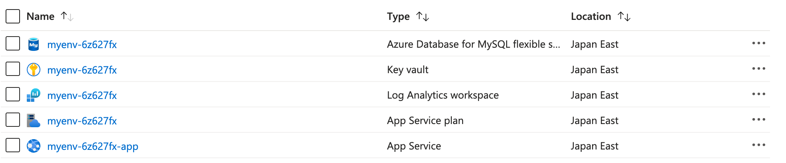
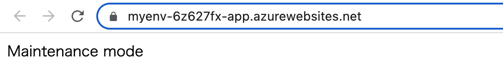
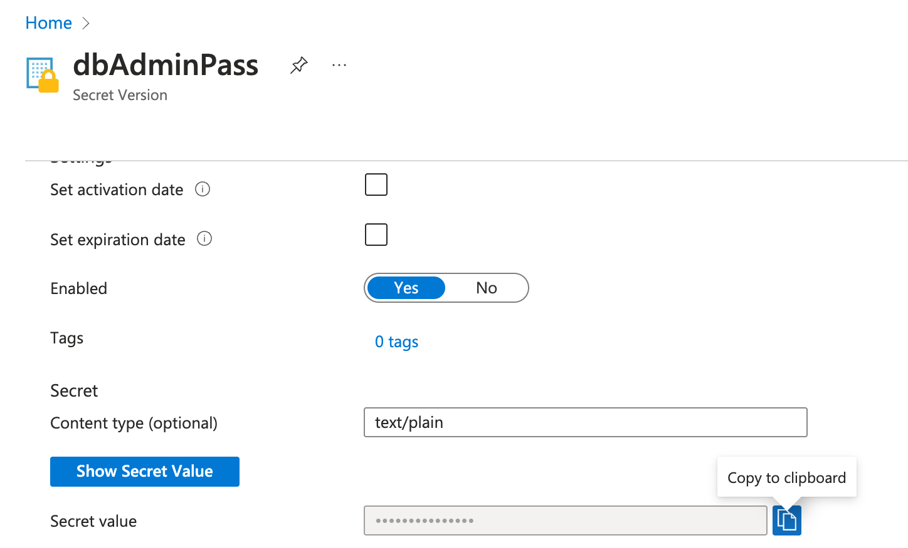

# Redmine on Azure App Service

## Introduction

DX2 DevOps solution for [Redmine] or [RedMica] on [Azure Web App for Containers].

The project provides public container images at ghcr.io
and suggests the workflow that supports the complete life cycle of Redmine apps (create/update/backup/restore)
on the Azure App Service infrastructure.
It utilizes a variety of App Service features like app settings, persistent storage, SSH connections, etc.

[Redmine]: https://github.com/redmine/redmine
[RedMica]: https://github.com/redmica/redmica
[Azure Web App for Containers]: https://azure.microsoft.com/ja-jp/services/app-service/containers


## Container features

### Application settings / environment variables

|Variable|Description|
|---|---|
|`WEBSITES_ENABLE_APP_SERVICE_STORAGE`|Set `true` to mount a persistent storage on /home in App Service containers.|
|`RAILS_ENV`|Set `production` or `development`|
|`RAILS_IN_SERVICE`|Set `true` to start the rails server normally.  Otherwise it enters the maintenance mode.|
|`SECRET_KEY_BASE`|Set a random string to encrypt rails session cookies.|
|`DATABASE_URL`|Rails database configuration.  See [the guide for configuring a database](https://guides.rubyonrails.org/configuring.html#configuring-a-database)|
|`DATABASE_FLEXIBLE`|Set `true` to use Azure Database for MySQL/PostgreSQL flexible server|

### Files and directories in a container

|Path|Description|
|---|---|
|`/redmine/`|Redmine app|
|`/docker/`|Various DevOps scripts and assets|
|`/home/site/wwwroot/`|Persistent data|
|`/home/site/wwwroot/redmine.sqlite3`|Default sqlite3 database in development|
|`/home/site/wwwroot/staticsite/`|Static site root for the maintenance mode|
|`/home/site/wwwroot/backups/`|Site backups|
|`/home/site/wwwroot/files/`|Symlinked from `/redmine/files`|
|`/home/site/wwwroot/config/*`|Symlinked from `/redmine/config/*`|
|`/home/site/wwwroot/plugins/*`|Symlinked from `/redmine/plugins/*`|
|`/home/site/wwwroot/public/themes/*`|Symlinked from `/redmine/public/themes/*`|
|`/home/site/wwwroot/public/plugin_assets`|Symlinked from `/redmine/public/plugin_assets`|

### Maintenance mode

When the container boots with `RAILS_IN_SERVICE=false` in the app settings,
it enters the maintenance mode.

In the maintenance mode,
the container only serves a static site from `/home/site/wwwroot/staticsite/`.
You can safely get the shell and do any maintenance tasks in the container with an SSH connection
via Azure Portal or Azure CLI ([az webapp ssh] or [az webapp create-remote-connection]).

After the maintenance is over, you should set `RAILS_IN_SERVICE=true` in the app settings.
It causes the container to restart and make the Redmine app in service.

[az webapp ssh]: https://docs.microsoft.com/en-us/cli/azure/webapp?view=azure-cli-latest#az-webapp-ssh
[az webapp create-remote-connection]: https://docs.microsoft.com/en-us/cli/azure/webapp?view=azure-cli-latest#az-webapp-create-remote-connection

### `rmops` command

`rmops` is a maintenance command available in the container.
It has many sub commands and helps you with various tasks like
the database initialization, the initial setup of Redmine app, backup/restore, etc.

```console
root@cb1e6cc8c0da:~# rmops
Commands:
  rmops dbcli           # Launch DB client
  rmops dbinit          # Initialize database
  rmops dbsql           # Generate SQL for initialization
  rmops dump            # Dump site to backup
  rmops entrypoint      # Container entrypoint
  rmops help [COMMAND]  # Describe available commands or one specific command
  rmops passwd          # Reset user password
  rmops restore         # Restore site from backup
  rmops setup           # Set up Redmine instance
```

The usage details will be explained as needed in the document.

### Persistent files

In Azure App Service,
files to preserve should be stored in the persistent storage
mounted on `/home/site/wwwroot`.
Any changes outside `/home/site/wwwroot` will be lost when the instance restarts.
Note that you have to set `WEBSITES_ENABLE_APP_SERVICE_STORAGE=true` in the app settings
to mount the persistent storage on `/home/site/wwwroot`.

Therefore, in the Redmine containers,
many files and directories in `/redmine` are symbolic links to ones in `/home/site/wwwroot`.
Creating links is done by `rmops entrypoint` every time a container boots.
You can utilize it to inject your instance-specific modifications.
For example, you can place Redmine plugins in `/home/site/wwwroot/plugins`,
Redmine themes in `/home/site/wwwroot/public/themes`,
Rails `configuration.yml` in `/home/site/wwwroot/config/configuration.yml`, and so on.

## Deploy to Azure App Service

### Quick start with Azure Developer CLI (recommended)

Using [Azure Developer CLI](https://learn.microsoft.com/en-us/azure/developer/azure-developer-cli/overview) (azd),
you can easily deploy Redmine/RedMica web sites using Azure App Service and Azure Database for MySQL/PostgreSQL.

1. Create an azd environment and set some required variables in it.

    ```console
    $ azd env new myenv
    $ azd env set DB_TYPE mysql
    $ azd env set APP_NAME app
    ```

    - `DB_TYPE` ... `mysql` or `psql`
    - `APP_NAME` ... App name to deploy.  If empty, it deploys only App Service Plan.
    - `APP_IMAGE` ... (Optional) Choose one from the following images:
        - `ghcr.io/yaegashi/dx2devops-redmine/redmine`
        - `ghcr.io/yaegashi/dx2devops-redmine/redmica` (default)

2. Log in to Azure with azd and deploy the resources.
You have to select Azure subscription and region to deploy.

    ```console
    $ azd auth login
    $ azd provision

    Provisioning Azure resources (azd provision)
    Provisioning Azure resources can take some time.

    ? Select an Azure Subscription to use:  2. Pay-As-You-Go (58110a2c-a91b-4fdd-b8ea-3c16e75106ac)
    (✓) Done: Retrieving locations...
    ? Select an Azure location to use:  9. (Asia Pacific) Japan East (japaneast)
    Subscription: Pay-As-You-Go (58110a2c-a91b-4fdd-b8ea-3c16e75106ac)
    Location: Japan East

      You can view detailed progress in the Azure Portal:
      https://portal.azure.com/#view/HubsExtension/DeploymentDetailsBlade/~/overview/id/%2Fsubscriptions%2F58110a2c-a91b-4fdd-b8ea-3c16e75106ac%2Fproviders%2FMicrosoft.Resources%2Fdeployments%2Fmyenv-1699051704

      (✓) Done: Resource group: rg-myenv
      (✓) Done: Resource group: rg-myenv
      (✓) Done: App Service plan: myenv-6z627fx
      (✓) Done: App Service: myenv-6z627fx-app

    Congratulations!  The Redmine app has been successfully deployed to Azure.

    App link (the service initially starts in maintenance mode):
    https://myenv-6z627fx-app1.azurewebsites.net

    App console link:
    https://myenv-6z627fx-app1.scm.azurewebsites.net/webssh/host

    App resource link in the Azure Portal:
    https://portal.azure.com/5f534ef1-2ab5-4f8e-bf2e-4886cd321c8e#resource/subscriptions/58110a2c-a91b-4fdd-b8ea-3c16e75106ac/resourceGroups/rg-myenv/providers/Microsoft.Web/sites/myenv-6z627fx-app1

    DB admin username:
    adminuser

    DB admin password link in the Azure Portal:
    https://portal.azure.com/5f534ef1-2ab5-4f8e-bf2e-4886cd321c8e#asset/Microsoft_Azure_KeyVault/Secret/https://myenv-6z627fx.vault.azure.net/secrets/dbAdminPass

    Run the following commands on the app console to set up the Redmine app:
    rmops dbinit       # Use the DB admin username and password above
    rmops setup        # The initial password for the Redmine admin will be shown
    rmops passwd admin # Use this in case you forget the Redmine admin's password

    Set RAILS_IN_SERVICE=true in the app settings to exit maintenance mode.

    SUCCESS: Your application was provisioned in Azure in 6 minutes 49 seconds.
    You can view the resources created under the resource group rg-myenv in Azure Portal:
    https://portal.azure.com/#@/resource/subscriptions/58110a2c-a91b-4fdd-b8ea-3c16e75106ac/resourceGroups/rg-myenv/overview
    ```

3. Open the resource group link in the last line.  You can find the following resources deployed by running `azd provision`:

    > 

    - Azure Database for MySQL or PostgreSQL (flexible server): `${ENV_NAME}-xxxxxxx`
    - Key vault: `${ENV_NAME}-xxxxxxx`
    - Log Analytics workspace: `${ENV_NAME}-xxxxxxx`
    - App Service plan: `${ENV_NAME}-xxxxxxx`
    - App Service app: `${ENV_NAME}-xxxxxxx-${APP_NAME}`

4. Open `App link` that looks like `https://${ENV_NAME}-xxxxxxx-${APP_NAME}.azurewebsites.net`.
It will only display the text message `Maintenance mode`
because `RAILS_IN_SERVICE` is initially set to `false` in the app settings.

    > 

5. Open `App console link` to connect into the container via SSH.
Run `rmops dbinit` to initialize the database.

    ```console
    root@cb1e6cc8c0da:~# rmops dbinit
    Enter DB admin username: adminuser
    Enter DB admin password: 
    I, [2023-11-03T23:02:50.950826 #16]  INFO -- : Create database
    I, [2023-11-03T23:02:50.952936 #16]  INFO -- : Run ["mysql", "--ssl", "-h", "myenv-6z627fx.mysql.database.azure.com", "-P", "3306", "-u", "adminuser"]
    I, [2023-11-03T23:02:51.366948 #16]  INFO -- : Done database initialization    
    ```
    - DB admin username ... `adminuser`
    - DB admin password ... the secret value of `dbAdminPass` in the key vault.
      Open `DB admin password link in the Azure Portal` then copy/paste the secret value.
        > 

6. Run `rmops setup` to perform the database migration.
It displays the Redmine admin password in the end of output.

    ```console
    root@cb1e6cc8c0da:~# rmops setup
    I, [2023-11-03T23:03:56.144343 #18]  INFO -- : Enter directory at /redmine
    I, [2023-11-03T23:03:56.154043 #18]  INFO -- : Remove ["files", "public/plugin_assets"]
    I, [2023-11-03T23:03:56.154433 #18]  INFO -- : Create ["/home/site/wwwroot/files", "/home/site/wwwroot/config", "/home/site/wwwroot/plugins", "/home/site/wwwroot/public/themes", "/home/site/wwwroot/public/plugin_assets", "/home/site/wwwroot/staticsite", "/home/site/wwwroot/backups"]
    I, [2023-11-03T23:03:56.184725 #18]  INFO -- : Symlink "/home/site/wwwroot/files" to "./files"
    I, [2023-11-03T23:03:56.192230 #18]  INFO -- : Symlink "/home/site/wwwroot/public/plugin_assets" to "./public/plugin_assets"
    I, [2023-11-03T23:03:56.196898 #18]  INFO -- : Enter directory at /redmine
    I, [2023-11-03T23:03:56.200515 #18]  INFO -- : Run "rake db:migrate"
    I, [2023-11-03T23:04:11.776417 #19]  INFO -- : Migrating to Setup (1)
    == 1 Setup: migrating =========================================================
    -- create_table("attachments", {:options=>"ENGINE=InnoDB", :force=>true, :id=>:integer})
       -> 0.0801s    
    ...
    I, [2023-11-03T23:05:28.855548 #18]  INFO -- : Reset password for user "admin"
    I, [2023-11-03T23:05:28.864872 #18]  INFO -- : New password: "XOXecy067zRDlFXW"
    ```

7. Open `App resource link in the Azure Portal` and set `RAILS_IN_SERVICE` to `true` in the app settings.

8. Open `App link` and you can see the Redmine site configured.
Log in with the user `admin` and the password shown by `rmops setup`.

9. You can populate more Redmine apps in the same azd environment with the same App Service plan and database
by repeating setting `APP_NAME` and running `azd provision`:

    ```console
    $ azd env set APP_NAME app2
    $ azd provision
    $ azd env set APP_NAME app3
    $ azd provision
    ```

## Local development

[compose.yml](docker-compose.yml) is provided
so that you can easily build and test Redmine container images.
Using a devcontainer is also recommended.

1. Place Redmine sources in `redmine` directory.
You can clone it from the official repository by either of the following commands:
    * Run `git clone https://github.com/redmine/redmine` for Redmine
    * Run `git clone https://github.com/redmica/redmica redmine` for RedMica
2. Copy file [`docker.env.example`](docker.env.example) to `docker.env`.
3. Copy file [`.env.example`](.env.example) to `.env` and set `COMPOSE_PROFILES` in it.
Choose one of the supported profiles: `sqlite`, `mysql`, `mariadb`, `postgres`.
4. Run `docker compose build` to build a container image.
5. Run `docker compose up -d` to start containers in the background.
    * The redmine container creates `./data/wwwroot` for `/home/site/wwwroot` volume.
    * The redmine container enters the maintenance mode because `RAILS_IN_SERVICE=false` in `docker.env`.
    * The database container creates `./data/mysql` etc. for the database volume.
6. Do the following initial setups in the container:
    1. Invoke a shell in the redmine container by either of the following methods:
        * Run `docker compose exec redmine-<profile> bash`
        * Run `ssh root@localhost -p 3333`.  The password is `Docker!`.
    2. Run `rmops dbinit`.  The password is `secret`.
    3. Run `rmops setup`.  Redmine admin's password will be shown.
    4. Exit from the shell.
7. Update `RAILS_IN_SERVICE=true` in `docker.env`.
8. Run `docker compose up -d` again to restart the redmine container.
9. Open http://localhost:8080 with your web browser to test the Redmine app.

## Roadmap

### Completed

- Persistent storage support (uploaded files, themes, plugins, etc.)
- SSH remote shell and maintenance mode support
- Azure Developer CLI support
- Azure Database for MySQL/PostgreSQL flexible server support
- Azure App Service Easy Auth support (https://github.com/yaegashi/redmine_easyauth)
- `rmops` maintenance commands
    - dbcli: Launches database client
    - dbsql: Generates SQL to initialize database
    - dbinit: Initializes database
    - setup: Performs Redmine initial setup
    - passwd: Resets Redmine user password
    - dump: Dumps to backup
    - restore: Restores from backup

### Upcoming

- Email sending support from the App Service environment
